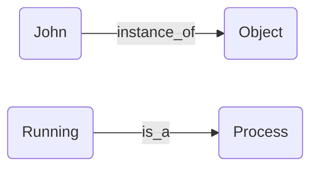

# Project 3

Your third project will require you to answer each of the 10 questions below.  You will be expected to open a pull request with your initial answers by the second class meeting, giving you one week to work on these problems. You and your peers will then have one week to work together to refine your respective initial answers, so they are ready for final submission. Once your pull requests have been reviewed and merged to the development branch, I will review them, then merge to the master branch. 

```
For any question involving the use of Protege, please be sure to import:
1. Basic Formal Ontology (https://raw.githubusercontent.com/BFO-ontology/BFO/v2019-08-26/bfo_classes_only.owl)
2. The Relations Ontology (https://raw.githubusercontent.com/oborel/obo-relations/master/ro.owl)
```

1. In BFO and RO identify at least one object property for each of a-e that _should have the listed property, but which does not_; argue for your case, using examples. Note: It will be easiest to view the object properties in BFO and RO using Protege. 
```
  (a)  Reflexive
  The object property, “overlaps”, should have the reflexive characteristic listed. It’s definition states: x overlaps y if and only if there exists some z such that x has part z and z part of y. Reflexivity is the characteristic that expresses the relation that an entity be related to itself.The object property “overlaps” should have reflexive as a listed characteristic since an object shares itself (and parts of itself) with itself.

  (b)  Transitive 
  The object property, “existence ends with”, should have the transitive characteristic listed.It’s definition states: “x existence ends with y if and only if the time point at which x ends is equivalent to the time point at which y ends. Formally: x existence ends with y iff ω(x) = ω(y).” 

That is, if any entity x ends at the equivalent time point of any other entity y, then they share the same object property, “existence ends with”.

Thus, any entity x that ends at a shared equivalent time point with entity y, and entity y ends at a shared equivalent time point with entity z, then entity x will share an end equivalent time point with entity z. If entity x shares the same object property, i.e. existence ends with, with entity z, then the relation must be transitive. 

Therefore, the object property “existence ends with” should have transitive as a listed characteristic. 

  (c)  Symmetric
  'is mutualism' (RO_0002467) should be symmetric, since to include x and y in a system of mutual benefit z, then x's membership in z is (directly or indirectly) beneficial for y, and y's membership in z is (directly or indirectly) beneficial for x
  
  (d)  Functional
  'has end location' (RO_0002232) should be functional, since for whatever location there can only be one end
  
  (e)  Symmetric and Reflexive
  The object property, “simultaneous with”, should have the symmetric and reflexive characteristic listed. 

It’s definition states: t1 simultaneous_with t2 iff:=  t1 before_or_simultaneous_with t2  and not (t1 before t2).

It’s reflexive, since any time must be simultaneous with itself. And it’s symmetric, since, if t1 is simultaneous with t2, then t2 must be simultaneous with t1.

Therefore, the object property “simultaneous with” should have reflexive and symmetric as its listed characteristics.
  
  
```

2. In BFO and RO identify at least one object property for each of a-e that _should not have the listed property, but which does_; argue for your case, using examples. Note: It will be easiest to view the object properties in BFO and RO using Protege.
```
  (a)  Irreflexive
  The object property, “has role in modeling”, should not have the irreflexive property listed.

It’s definition states: “A relation between a biological, experimental, or computational artifact and an entity it is used to study, in virtue of its replicating or approximating features of the studied entity.” 

Imagine a machine that is designed to model aspects of itself. It can be used to study itself, in virtue of its ability to reflect aspects of itself. However, an irreflexive property relation is one such that an entity cannot relate to itself.
 
Thus, although the object property, “has role in modeling”, has the irreflexive property listed, it should not. 
  
  (b)  Transitive
  The object property, “aligned with”, should not have the transitive property listed. 

Finn: Imagine two lines of blocks that intersect at block B. Call one row 'Vertical' and the other 'Horizontal'. A is a block in Vertical, but not Horizontal. C is a block in Horizontal, but not Vertical. And B is in both Vertical and Horizontal. A is aligned with B, since they're in the same row, and B is aligned with C for the same reason, but A is not aligned with B.

For this object property, there is no definition expressed. Instead, there is an editor’s note that states: “May be obsoleted, see https://github.com/oborel/obo-relations/issues/260”. If you follow this link, you will see four collaborators deliberate on whether to make this term obsolete. It was cited that “aligned with” was used to define at least one widely used relation, “fasciculates with”. Upon searching this object property, it is now a subproperty of “overlaps”. Subsequently, on October 15th, 2020, nlharris added the obsolete label to the term.

Due to the fact that there lacks a definition and “aligned with” is insufficient to establish that it holds a transitive characteristic, the transitive characteristic should be unlisted. 

Transitivity means that if individual x is related to individual y, and individual y is related to individual z, then individual x will be related to individual z. In other words, a single “hop” is implied over a chain of two along a given property if that property is transitive. 

Based on its label, one cannot infer that “aligned with” necessitates a transitive relation between x and z. For example, x may be aligned with y, y may be aligned with z, but x may not be aligned with z. It would be said that x is aligned with y (i.e. shares a border), but x is not aligned with z. 

Moreover, aligned with could also mean an overlapping relation, rather than sharing a border. This further problematizes the vagueness of the term. 

Thus, because (1) there is no clear definition, (2) the label, “aligned with”, is ambiguous, and (3) pragmatically speaking, the term has been rendered obsolete, I recommend that the transitive characteristic be unlisted. It is not clear that “aligned with” is transitive. For the reasons cited above with examples, both intransitive bordering relations and overlapping relationships can be inferred by its label and yet, the object property is not clear whether it means to represent both kinds of relations.

  (c)  Asymmetric
  The object property, “has role in modeling”, should not have the asymmetric property listed.

It’s definition states: “A relation between a biological, experimental, or computational artifact and an entity it is used to study, in virtue of its replicating or approximating features of the studied entity.” 

In BFO, an artifact is defined as: “something that is deliberately designed (or, in certain borderline cases, selected) by human beings to address a particular purpose” (3).
Barry Smith elucidates on this further: “While not all representational artifacts are ontologies, all ontologies are representational artifacts, and thus everything that holds of representational artifacts in general holds also of ontologies” (3). 

Conceptually, the import of this is that if artifact x has a role in modeling entity y, artifact x’s relation between entity y is subject to the same BFO domain rules as everything else. That is, if the declared characteristic of an artifact x is universally declared to be asymmetric to an entity y, then it follows that there are no such cases where the relationship between artifact x and entity y is symmetric. Its plausible that artifact x’s possible relations to entity y may in some cases be asymmetric (e.g. healthy cell line [artifact] → inducing disease [entity]), in others they may be symmetric (e.g. diseased model organism [artifact] → same diseased model organism over time [entity]), and further still, it might best to remain agnostic in such relations, leaving the characteristics neither asymmetric or symmetric, for garnering preferred inference modeling conditions for particularized ends. 

In order to have a wide ranging and flexible “has role in modeling” object property to classify possible relations between an artifact x and entity y, I argue that it is more advantageous and preferable to unlist the asymmetric characteristic so that possible symmetry relations and relations where it is best to remain agnostic on symmetry/asymmetry assertions may be represented in artifact to entity modeling relations. This is both an appeal to pragmatic and philosophical reasons. Unless all relations between artifact x and entity y are asymmetric, they should not be listed as such. By doing so, other non-asymmetric modeling relations cannot adequately be represented.

Thus, although the “has role in modeling” object property has the asymmetric characteristic listed (likely for pragmatic purposes specific to modeling ontologies with distinct ends), I argue that it would be better to dispense with it if one’s aim is to represent a wider domain of possible symmetric/asymmetric relations between artifacts with specific modeling roles and entities. Moreover, a more robust and comprehensive ontology would be representable as a result of unlisting the asymmetric characteristic.

  (d)  Functional
  The object property, “characteristic of”, should not have the functional property listed.

It’s definition states: “a relation between a specifically dependent continuant (the characteristic) and any other entity(the bearer), in which the characteristic depends on the bearer for its existence.”

The functional property relation means that for any given individual, the property can have at most one value. In other words, there can be at most one out going relationship along the property for that individual. This means that a functional object property has a multiplicity 0..1 attached to it. For example, it might be said that the continuant red is “characteristic of” Washington Red Delicious Apples. Or put in another way, this red color is a characteristic of this Washington Red Delicious Apple. 

However, it is not the case that a given characteristic necessarily corresponds with at most one value, univocally. It could very well be the case that the red characteristic of Washington Red Delicious Apples might also have another corresponding value in a red colored car of the same hue. This means that correspondence between a characteristic and a bearer is not necessarily functional, i.e. has a binary value between 0 and 1 at most. 

A characteristic can have a one to one relationship to a bearer, a one to many relationship, a many to many relationship, or a many to one relationship. 

What could be the explanation of why this object property was set to having the functional characteristic? Upon further analysis, one can find a note in the ontology:

“Note that this relation was previously called "inheres in", but was changed to be called "characteristic of" because BFO2 uses "inheres in" in a more restricted fashion. This relation differs from BFO2:inheres_in in two respects: (1) it does not impose a range constraint, and thus it allows qualities of processes, as well as of information entities, whereas BFO2 restricts inheres_in to only apply to independent continuants (2) it is declared functional, i.e. something can only be a characteristic of one thing.”

(2) states: “it is declared, i.e. something can only be a characteristic of one thing.” What one might infer from this declaration is that this was done for pragmatic purposes in order to elicit preferred inference relations without having to deal with the burden of unwanted inferences to irrelevant elements. So for example, by declaring a functional constraint on “characteristic of” the ontologist could make pragmatic use of a delimited ontology that always garners a one to one relation, rather than a one to many, and so on. As a result, if the reasoner is run the functional constraint set will restrict the domain to one to one functional relations only. Thereby granting the conditions for a more specific, restricted ontology.
However, I must make a case for unlisting the functional characteristic. If I was an ontologist seeking to construct a knowledge base outside of a delimited domain of one to one functional relationships and wanted to represent the class of all red things, then I ought to unlist the functional characteristic so that the object property relation “characteristic of” could represent and infer a one to many relationship, which is not functional by definition, i.e. 0..1..X.

Thus, although the “characteristic of” object property has the functional characteristic listed likely for pragmatic purposes, I argue that it would be better to dispense with it if one’s aim is to represent relations that are one to many, many to one, or many to many.

  (e)  Inverse Functional
  The object property, “has characteristic”, should not have the inverse functional property listed.

It’s definition is the inverse of “characteristic of” (from [d]). The “characteristic of” object property’s definition is: “a relation between a specifically dependent continuant (the characteristic) and any other entity(the bearer), in which the characteristic depends on the bearer for its existence.”

This answer relies on what was said in (d), but is its inversion. 

Like the functional characteristic, the inverse functional property relation means that for any given individual, the property can have at most one value. In other words, there can be at most one out going relationship along the property for that individual. This means that an inverse functional object property has a multiplicity 0..1 attached to it. For example, it might be said that apples “has characteristic” color red. Or put in another way, this apple has this characteristic color red.

However, it is not the case that a given bearer necessarily corresponds with at most one characteristic value, univocally. It could very well be the case that a car might also have another corresponding value in a color red of the same hue. This means that correspondence between a characteristic and a bearer is not necessarily functional, i.e. has a binary value between 0 and 1 at most. 

A bearer can have a one to one relationship to a characteristic, a one to many relationship, a many to many relationship, or a many to one relationship.

As discussed in (d), it is inferred that as “characteristic of” was declared functional likely for pragmatic purposes, its inverse, “has characteristic”, follows the same constraints for the same reasons. Thus, the reason for which why I would like to make the case that the object property “has characteristic” should be unlisted are based on the same premises argued for in (d). That is, if I was an ontologist seeking to construct a knowledge base outside of a delimited domain of one to one functional relationships and wanted to represent the class of all bearers that have the characteristic color red, then I ought to unlist the inverse functional characteristic so that the object property relation “has characteristic” could represent and infer a many to one relationship or one to many relationship, which is not functional by definition, i.e. X…1 and 0..1..X.

Thus, although the “has characteristic” object property has the inverse functional characteristic listed likely for pragmatic purposes, I argue that it would be better to dispense with it if one’s aim is to represent relations that are many to one, one to many, or many to many.

  
  
```

3. Model the following natural language expressions using terms from BFO and RO; you are welcome to introduce new terms where needed:  
```
  (a) Sally has an arm Tuesday but does not have an arm Wednesday.
  Sally instance_of object
Tuesday instance_of one-dimensional temporal region 
Wednesday instance_of one-dimensional temporal region 
Arm instance_of fiat object part
“Sally participates in having at least one arm on Tuesday” instance_of occurrent 
“Sally participates in having no arms on Wednesday” instance_of occurrent
“Sally participates in having at most one arm on Wednesday” instance_of occurrent

Due to the vagueness of the statement above, we have narrowed the possible answers to the following two cases:

“Sally participates in having at least one arm on Tuesday precedes Sally participates in having no arms on Wednesday”
“Sally participates in having at least one arm on Tuesday precedes Sally participates in having at most one arm on Wednesday”

  (b) Every liver has some cell as part at all times it exists.
  Liver has_part_at_all_times some Cell
  
  (c) John was a child, then an adult, then a senior.
  John is an instance_of object
childhood is an instance_of occurrent.
adulthood is an instance_of occurrent.
seniorhood is an instance_of occurrent.

“John participates in childhood precedes John participates in adulthood which precedes John participates in seniorhood.”
  (d) Goofus and Gallant are married at each point in a three year span.
   Goofus is an instance_of object
Gallant is an instance_of object
Marriage is an instance_of occurrent
“Three years span 1” is an instance_of one-dimensional temporal region.
Notice that the original phrase doesn’t say anything about Goofus and Gallant being married to each other, and we won’t represent such a fact.
T1 is an instance_of zero-dimensional temporal region.
If zero-dimensional temporal region t1 is part_of the one-dimensional temporal region “three years span 1”, then Goofus participates in marriage at t1 and Galland participates in marriage at t1

   Goofus spouse_of Gallant at t1
  
  
```

4. Using the language of First-Order Logic, represent the following natural language expressions; you are welcome to introduce new terms where needed: 
```
  (a) Sally has an arm Tuesday but does not have an arm Wednesday.
   ∃x (Tx ∧ ∃y (Hsy∧Ay)) ∧ ∃x (Wx ∧ ~∃y(Hsy∧Ay))
  T: Tuesday
  H: has
  A: arm
  W: Wednesday
  s: Sally

  (b) Every liver has some cell as part at all times it exists.
    ∀x∃y(Lx→Cy∧Pyx)
  L: liver
  C: cell
  P: part of

  (c) John was a child, then an adult, then a senior.
  j = John
E (x, y) = being earlier than
C (x, t) = being a child at t
A (x, t) = being an adult at t
S (x, t) = being a senior at t
∃t1∃t2∃t3 (C (j, t1) ∧ A (J, t2) ∧ S(J, t3) ∧ E (t1, t2) ∧ E (t2, t3)

  (d) Goofus and Gallant have been married for three years; for each day of that span, it is true to assert they are married.
  Again, notice we are not modeling that Goofus and Gallant are married to each other.
M(x, t) = being married at t
Y(t) = belongs to 3 year span 1
g1 = Goofus
g2 = Gallant
D(t) = t is a day
∀t(D(t) ∧ Y(t)→(M(g1,t) ∧ M(g2,t))

```

5. Using BFO and RO, model the following scenario: the content of an rdf file is represented in two serializations - one in Turtle, one in XML - which are sent from one computer to two distinct computers on the same network.   


(Comment: This is a graph based on Mermaid and the above blackboard work. Simply speaking, This graph represents the following key relations:

– RDF File Content, Turtle and XML are all generically dependent continuants. RDF File Content has_model in Turtle and XML. And they are all carried by Computer.
– Computer 1 enables the process of Data Transmission, which ends_with another process, Data Reception, which has computers 2 and 3 as participants. So this part is intended to show that there is some data (Turtle and XML) which are sent from Computers 1 to Computer 2 and 3.
– Finally, computers 1, 2, and 3 are all parts_of network I, which is instance_of Object Aggregate.)

Note: In RDF, we have a triple like (s, p, o), meaning that the subject S is P-related (“p” as a predicate) to the object O. In Mermaid, this triple can be expressed as  “A(class/individual name of s) -->|p| B(class/individual name of O)”. So a Mermaid graph can be written in the following way:



When we assign “graph” as LR, it will unfold from left to right; when we assign it as TD, it will unfold from top to down. “A”, “B” and other capital letters can be used to define nodes in a Mermaid graph.


6. Using Protege, place these in the BFO hierarchy where you think they fit best:
```
  (a) Bach's Well-Tempered Clavier
  Generically dependent continuant (e.g.  the music composition), object (e.g. music sheet), or process (occurrent, e.g. playing the song)
  (b) Chair of the UB Philosophy Department
  Role
  (c) SARS-CoV-2
  Object/Material entity (e.g. virus) or disposition (e.g. disease symptoms)
  (d) Mexico City
  Site or 2D/3D spatial region (e.g. map or mapping) or Instance
  (e) The trunk of a minivan
  Site or fiat object part
  (f) Occupation
  Role
  (g) Ocean
  Site or 2D/3D spatial region
  (h) Lake
  Site or 2D/3D spatial region
  
```

7. True or False; explain your answers:
```
  (a) An instance of Material Entity can have an instance of Immaterial Entity as part.
  True. Smith’s textbook: “Immaterial entities listed under 1. (boundaries and sites) are in some cases continuant parts of their material.” (108)
  (b) An instance of Immaterial Entity can have an instance of Material Entity as part.
  False. (Explanation forthcoming)
  (c) An organization may have another organization as part.
  True. For example, a political committee can have a subcommittee as a part
  (d) An organization may have no members as part.
  True. The debate club could lose all its members while still be being recognized by the school.
  (e) Any site is partially bounded by some instance of Material Entity.
  True. The wording on the elucidation is a little confusing, but I think it’s implying that all sites are partially or wholly bounded by a material entity.
  (f) A book placed under the leg of a wobbly table has acquired a new function.
  False. The elucidation excludes this by saying that the function is due to the physical make-up of the object. Since nothing about the make-up changed, the book did not gain any new functions. If the book has the function of supporting the table, this is a function it has always had, even if it wasn’t intended to support the table
  (g) A glass vase cushioned with packing material for all time, has the disposition to break.
  True. Dispositions are in virtue of the bearer’s physical make-up, not its environment
  (h) Spacetime is a class in BFO.
  False. This is covered by spatiotemporal region
  (i) The continuant fiat boundary class of BFO is closed, meaning, there are no subclasses beyond those identified presently in BFO.
  False. "Continuant fiat boundary doesn't have a closure axiom because the subclasses don't necessarily exhaust all possibilities. An example would be the mereological sum of two-dimensional continuant fiat boundary and a one dimensional continuant fiat boundary that doesn't overlap it" (from the BFO file in Protege)
  
```

8. Model the following scenario in BFO, introducing whatever terms are needed to do so: John runs for 3 hours, startin slowly, speeding up during the middle, then ending the run at a slower pace.
This is a graph based on Mermaid, representing the following relations:

– John (as an Object) participates_in John’s running (as a process), and John has_characteristic_at_t1 John’s average speed 1, and John has_characteristic_at_t2 John’s average speed 2, and John has_characteristic_at_t3 John’s average speed 3. All of these speeds are instances of Quality. 

(Note: A line with two nodes in Mermaid is to represent a triple [subject, predicate, object], so I don’t know how to use Mermaid to express an ordered set of 4 elements like “John [1] has_characteristic [2] John’s average speed 1 [3] at t1 [4]”. At present what I can do is to insert the temporal parameter into the predicate “has_characteristic”.)

–  John’s running includes 3 temporal parts: John’s beginning stage, John’s middle stage, and John’s final stage, each of which is a process. Besides, John’s beginning stage precedes John’s middle stage which precedes John’s final stage.

– John’s running occurs_in this 3-hour, which is instance_of one-dimensional temporal region. This 3-hour also includes 3 temporal parts: t1, t2, and t3, each of which is also instance_of one-dimensional temporal region. Besides, t1 precedes t2, and t2 precedes t3. Moreover, John’s beginning stage occurs_in t1, John’s middle stage occurs_in t2, and John’s final stage occurs_in t3.

– Change in John’s speed: John's average speed 1 is decreased_in_magnitude_relative_to John's average speed 2 (that is, speed 1＜speed 2), and John's average speed 2 is increased_in_magnitude_relative_to John's average speed 3 (that is, speed 2＞speed 3). Moreover, John's Middle Stage has_part John's accelerating, and John's Final Stage has_part John's decelerating. John’s accelerating and his decelerating are both instances of process


9. The Pellet reasoner in Protege can be used in an incremental reasoning strategy. ELI5 when and why one should use Pellet for incremental reasoning. 
 Imagine you are playing with some building blocks to build a tower. Every time you add a block to the tower, you don't need to start building the tower from the beginning. You just need to add the new block on top of the tower.
In the same way, when we use Pellet to reason about an ontology, we don't need to start reasoning from the beginning every time we add new information to the ontology. Instead, Pellet remembers what it has already figured out and uses that knowledge to figure out what the new information means. This is kind of like adding a new block to the tower without starting from the beginning. Thus, Pellet is especially important for large, complex ontologies where re-computing all the results every time new information is added would take a long time. 

10. Protege reasoners will not allow you to combine certain properties, e.g. reflexivity and transitivity. If you attempt to assert such pairs of the same object property, then run the reasoner, nothing will happen. If you combine such properties while a reasoner is running, then ask to synchronize the reasoner, an error will be thrown. Provide a table or series of tables illustrating which pairs of properties cannot be combined in Protege, either because nothing happens when the reasoenr is run or because an error is thrown when synchronizing a reasoner after making such changes. Review the github docs on [creating tables in markdown](https://docs.github.com/en/get-started/writing-on-github/working-with-advanced-formatting/organizing-information-with-tables).


Note: In the above table, there are 21 different sorts of possibilities in total. We use "Yes" to represent a case where a pair of object property characteristics can be combined, and "No" to represent a case where a pair of object property characteristics cannot be combined.
As a result, we find that there are 7 sorts of cases where a pair of object property characteristics cannot be combined:
 (1) The following 3 pairs cannot be combined because of a logical contradiction:
Asymmetric & Reflexive, Asymmetric & Symmetric, and Reflexive & Irreflexive.
(2) The following 4 pairs cannot be combined because of a more subtle factor. That is, an assertion of transitivity leads to a result that the target object property becomes non-simple (see Baader's book: section 8.1, page 211), so it is beyond the capacity limit of the reasoner:
Transitive & Functional, Transitive & Inverse Functional, Transitive & Asymmetric, and Transitive & Irreflexive.
